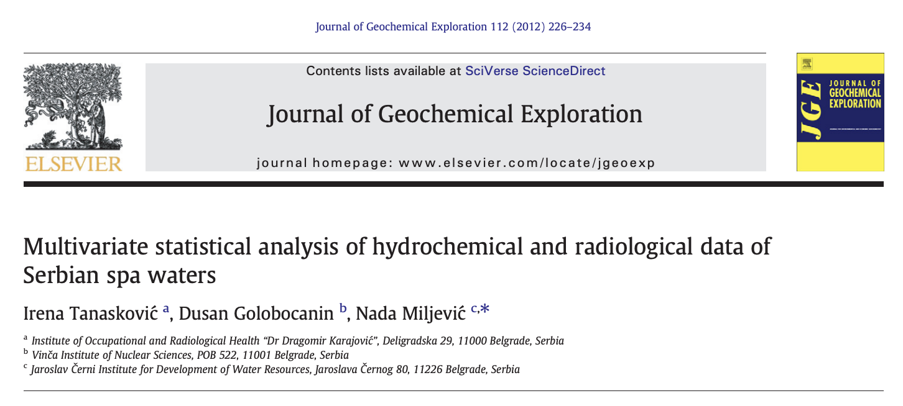

## The Report

-   Sampled spa water from 30 locations across Serbia.

-   Measured 18 variables from 4 types of geological structure.

-   12 hydrochemical variables.

-   6 Radioactive Isotopes.

-   Aimed to classify and group spa waters based on hydrochemical properties, radioactive isotopes, and geological structure.

-   Analysed the data using Pearson correlation, PCA, and HCA.

------------------------------------------------------------------------

## Our Analysis

We aimed to answer the following questions about the hydrological data using quantitative and qualitative analysis methods.

-   Can you improve the paper’s results using Factor Analysis in terms of model quality with parsimony?

-   Are the groups identified by the dendrogram consistent with changes in the linkage and distance?

---

## Samples Consistency Analysis

---

```{r install-packages, eval=FALSE}

install.packages(c("reshape2", "ggplot2", "ggcorrplot", "GGally", "psych", "ggnewscale","rstatix", "tidyverse","dendextend", "car", "here", "pander"))
install.packages("devtools")
devtools::install_github("vqv/ggbiplot")


```

```{r load-libraries}
library(rstatix)
library(MASS)
library(car)
library(here)
library(reshape2)
library(ggplot2)
library(ggcorrplot)
library(GGally)
library(ggbiplot)
library(psych)
library(ggnewscale)
library(pander)
library(tidyverse)
library(dendextend)

set.seed(123)
```

```{r data-reading-cat}
data <- read.csv(file.path("..","..","Data","Data.csv"), header=TRUE)
names(data) <- c("No.", "Name", "Temp", 
              "pH",
              "EC", 
              "TS", 
              "CA2+", 
              "Mg2+", 
              "NA+", 
              "k+", 
              "Cl-", 
              "SO2-4", 
              "HCO-3", 
              "SiO2",
              "Geological Structure",
              "Geotectonic Zone")

X = data[,3:14]
```

```{r clean-data}
data_spa_waters <- read.csv(file.path("..", "..","Data","Hydrochemical Data.csv"), header=TRUE)
data_spa_waters_classes <- data_spa_waters[-1, -c(1, 2)]
ncolumns_data_spa_waters_classes <- ncol(data_spa_waters_classes)
```

```{r convert-numeric}

data_spa_waters_classes[-c(ncolumns_data_spa_waters_classes - 1, ncolumns_data_spa_waters_classes)] <-
  lapply(
    data_spa_waters_classes[-c(ncolumns_data_spa_waters_classes - 1, ncolumns_data_spa_waters_classes)],
    function(x) round(as.numeric(x), 3)
  )

# Set Structure and Region as factors
data_spa_waters_classes$Geological.structure <- as.factor(data_spa_waters_classes$Geological.structure)
data_spa_waters_classes$Region <- as.factor(data_spa_waters_classes$Region)
```

```{r raw-data}

data_spa_waters_raw <- data_spa_waters_classes[, -c(ncolumns_data_spa_waters_classes - 1, ncolumns_data_spa_waters_classes)]


```

```{r data-read-jack}

data <- read.csv(file.path("..","..","Data","Data.csv"), header=TRUE)

hydroclean<-data[, 3:14]
as.numeric(hydroclean$T)->hydroclean$T
as.numeric(hydroclean$EC)->hydroclean$EC
as.numeric(hydroclean$TS)->hydroclean$TS
as.numeric(hydroclean$Ca2.)->hydroclean$Ca2.
```

### Key Findings - Mahalanobis

-   10 surprising observations past the first two cut points.

-   5 past all three.

-   Observations: 1, 2, 4, 15, 16, 23, 24, 28, 29 and 30.

```{r mahalanobis-setup, Echo = FALSE}

mu.hat <- colMeans(data_spa_waters_raw)
Sigma.hat <- cov(data_spa_waters_raw)

dM <- mahalanobis(data_spa_waters_raw, center = mu.hat, cov = Sigma.hat)

upper.quantiles <- qchisq(c(.9, .95, .99), df = 9)
density.at.quantiles <- dchisq(x = upper.quantiles, df = 9)
cut.points <- data.frame(upper.quantiles, density.at.quantiles)
```

```{r mahalanobis-plot, echo = FALSE, fig.width=6, fig.height=6}

ggplot(data.frame(dM), aes(x = dM)) +
  geom_histogram(aes(y = after_stat(density)), bins = nclass.FD(dM),
                 fill = "white", col = "black") +
  geom_rug() +
  stat_function(fun = dchisq, args = list(df = 9),
                col = "red", size = 2, alpha = .7, xlim = c(0, 25)) +
  geom_segment(data = cut.points,
               aes(x = upper.quantiles, xend = upper.quantiles,
                   y = rep(0, 3), yend = density.at.quantiles),
               col = "blue", size = 2) +
  xlab("Mahalanobis distances and cut points") +
  ylab("Histogram and density")
```

---

### Key Findings - Pairs Plot

-   Strong positive relationship between EC and TS.

-   $Cl^-$ and $Mg^{2+}$ have high right-skew.

-   Difference in EC and TS values across surprise levels.

```{r surprise-classification}

data_spa_waters_raw$dM <- dM
data_spa_waters_raw$surprise <- cut(
  data_spa_waters_raw$dM,
  breaks = c(0, upper.quantiles, Inf),
  labels = c("Typical", "Somewhat", "Surprising", "Very")
)
```

```{r pairs-plot-surprise, fig.width=9, fig.height=9}

ggpairs(data_spa_waters_raw, columns = 1:9,
        ggplot2::aes(col = surprise, alpha = .5),
        upper = list(continuous = "density", combo = "box_no_facet")) +
  ggplot2::scale_color_manual(values = c("lightgray", "green", "blue", "red")) +
  ggplot2::theme(axis.text.x = element_text(angle = 90, hjust = 1))
```

---
